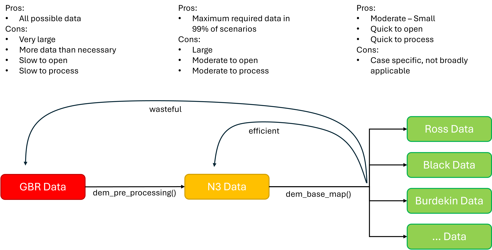
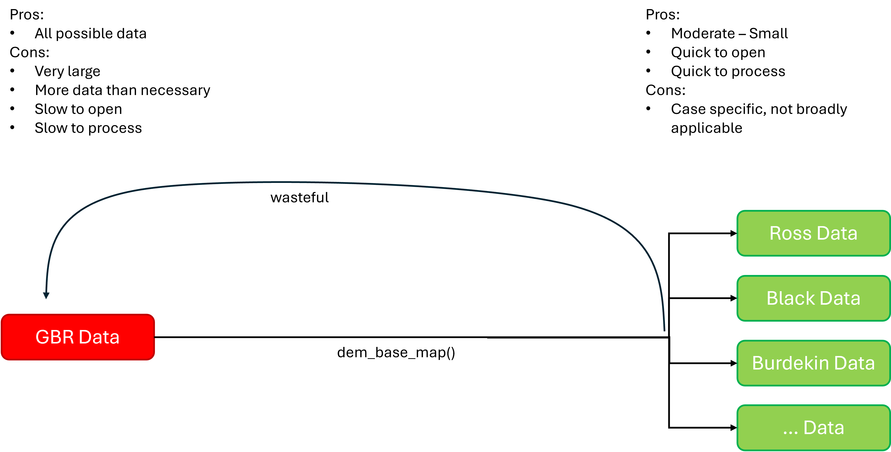

# Digital Elevation Models

## Introduction

A fun side project that was discovered when searching for useful
datasets was the ability to create digital elevation models (3D maps) of
the Northern Three Region. This work currently has no real bearing on
producing technical reports or calculating report card scores, but can
be used to complete the following tasks:

- Create visually interesting maps of a location
- Emphasize a feature related to height, such as a particular mountain
  and its influence on water dynamics
- Calculate custom catchments based on water dynamics

Four functions have been written to assist in the completion of these
tasks, they are:

1.  dem_pre_processing()
2.  dem_base_map()
3.  dem_polygon_highlight()
4.  dem_water_overlay()

## General Workflow

The general workflow of these functions can be demonstrated as follows:

### Download Data

- GBR data is provided by [AUS
  SEABED](https://portal.ga.gov.au/persona/marine) as a GeoTIFF.
- Select “Layers” from the toolbar at the top of the page
- Select “Elevation and Depth” and then “Bathymetry - Compilations”
- Search for:
  - “Great Barrier Reef Bathymetry 2020 30m” and click it.
  - “Great Barrier Reef Bathymetry 2020 100m” and click it.
- Click “about”, then click “More Details” (The “download here” button
  sometimes does not work).
- On the new page download the data from the link under “Description”
- Unzip the downloaded folder
- Save the files where you need them to be, note that the 30m and 100m
  files should be kept in separate folders

### Pre Process Data

The files downloaded above are very large, infact the 30m resolution
data is so large it comes in 4 separate files. The dem_pre_processing()
function helps to reduce the size of these files and make them easier to
handle. It does three key things:

1.  It combines the four 30m files into a single file,
2.  It crops the data using a polygon of your specification,
3.  It saves the data to a location of your choosing.

The function can be used as follows.

``` r
#define the sf object you will crop the data with (in this case we will use the entire n3 region)
crop_object <- build_n3_region()

#run the function
n3_30m_dem <- dem_pre_processing(
  RawPath = "path/to/raw/folder/", 
  OutputPath = "path/to/save/location/",
  FileName = "my_30m_n3_dem",
  CropObj = crop_object,
  Reload = TRUE, #you can reload files to save time (if they have been created already)
  Overwrite = FALSE, #you can overwrite files that have the same name if needed
  Crs = "EPSG:4326" #generally it is recommended to stick with EPSG:4326 (global) or EPSG:7844 (East Aus) projections
)
```

Note that when you download data you can download both the 100m and 30m
resolution versions. The 100m version is good for quick iterations and
validating a workflow. The 30m version is good for a finished product
(but takes much longer to run). In either case the pre processing
function handles inputs the same way. Specifically, you only provided
the path to the **folder** that contains the files, not the files
themselves. The function looks in the folder that you specified and
picks up all files with the .tif extension. If it detects one file it
will follow the 100m workflow, if it detects more than one file it will
follow the 30m workflow. Thus, it is important that the 30m data and
100m data are kept in seperate folders otherwise it will all be snapped
up by the one function and cause an error.

The output of this function is a cutdown and aggregated version of the
raw data. In the example above we went from data for the entire GBR
(land and sea) down to just data for the Northern Three region (land and
sea). The data is saved to file, and returned to the global environment
so you can continue your workflow.

### Base Map Data

The next function follows directly on from the previous function, and
directly takes the product of the previous function. The dem_base_map()
function has been designed to produce four key outputs that are critical
for actually producing anything with DEM data, these outputs are:

1.  A raster object
2.  An array object
3.  A matrix object
4.  An extent object

The function works as follows.

``` r
#define the sf object you will crop the data with (in this case we will use the ross basin)
ross_basin <- build_n3_region() |> 
  filter(BasinOrZone == "Ross", Environment != "Marine")

base_map_objects <- dem_base_map(
  sr = n3_30m_dem, #provide the "SpatRaster" (sr) produced by the previous function
  OutputPath = "path/to/output/folder/",
  FileName = "my_30m_ross_dem",
  Zscale = 30, #describes x/y ratio, match this to data resolution
  CropObj = ross_basin,
  Reload = TRUE,
  Overwrite = FALSE,
  Texture = "desert", #colour palette, options do exist
  SeaLevel = 0,
  Crs = "EPSG:4326" #be consistent with the previous function
)
```

You will note that this function also has the ability to crop the data.
You may wonder why we would crop data twice in a row. The key reason for
this is the raw data spans the entire GBR, but generally we are only
interested in the Northern Three Region. Thus, we can save time but not
having to load in the entire GBR each time. Second, if we crop
specifically to the Ross basin using the preprocessing function we would
then be unable to recycle the pre processed data for another map,
e.g. in the Black basin, without going all the way back to the GBR data.
The workflow can be visualised like this:



workflow 1

As opposed to a more wasteful version like this:



workflow 2

This function saves the three outputs to file, and returns them to your
global environment as a list. You access them using double square
brackets and the object type as its name:

``` r
base_map_objects[["raster"]]
base_map_objects[["array"]]
base_map_objects[["matrix"]]
base_map_objects[["extent"]]
```

If you were interested in creating several maps, these could be combined
into a map as follows:

``` r
#create list of basins to taget
basin_list <- list("Ross", "Black")

#create a list of crop objects
basin_boundaries <- purrr::map(basin_list, \(x) filter(n3_region, BasinOrZone == x, Environment != "Marine"))

#iterate over the base map function, which returns a nested list
list_of_objects <- purrr::map2(basin_list, basin_boundaries, \(x,y) {

  objs <- dem_base_map(
    sr = n3_30m_dem, 
    OutputPath = "path/to/output/folder/",
    FileName = x,
    Zscale = 30,
    CropObj = y,
    Crs = "EPSG:4326" 
  )

  return(objs)

})
```

which is exactly what the preferred workflow is demonstrating.

### Visualisation

Once you have the three key objects (raster, array, matrix, extent).
Your workflow can deviate, either you can create a 3D map, or work
towards custom catchment boundaries.

#### 3D Maps

There are two additional custom functions for making 3D maps. Although
neither actually creates the map for you. To create the map, you need to
use the following code:

``` r
plot_3d(
   base_map_objects[["array"]], 
   base_map_objects[["matrix"]], 
   windowsize = c(50, 50, 1920, 1080), 
   zscale = 50, theta = 45.54, phi = 36.77, fov = 0, zoom = 0.61)
```

This opens a new window on your computer that is interactive. You can
pan, zoom, and drag the map around.

Following this, if you want to highlight a particular area (for example,
the Bohle sub basin), a custom function has been written to achieve
that. The function dem_polygon_highlight() allows you to provide a
polygon of the area you wish to highlight, and handles all of the back
end. The function works by taking a few key arguments:

- The polygon describing where you want to highlight
- Plus the extent, array, and matrix of the map (all from the base_map
  function).

It then embeded the polygon highlight into the original array object.
Thus it is very important that the output of this function is reassigned
back to the original array object:

``` r
#create a bohle focused polygon
bohle <- n3_region |> 
  filter(SubBasinOrSubZone == "Bohle")

#create the overlay
base_map_objects[["array"]] <- dem_polygon_highlight(
  maggie,
  base_map_objects[["extent"]],
  base_map_objects[["array"]],
  base_map_objects[["matrix"]]
)
```

You then simply re run the map as you did above, and the highlight will
then be visible:

``` r
plot_3d(
   base_map_objects[["array"]], 
   base_map_objects[["matrix"]], 
   windowsize = c(50, 50, 1920, 1080), 
   zscale = 50, theta = 45.54, phi = 36.77, fov = 0, zoom = 0.61)
```

The final function under this workflow is to add water bodies to the
map. The function, dem_water_overlay(), acts similarly to the highlight
function in that it returns the original array object with the
waterbodies embeded within. The function works by taking a few key
arguments:

- An sf object describing waterbody **lines** (mandatory), such as
  rivers
- An sf object describing waterbody **polygons** (optiona), such as
  lakes
- Plus the extent, array, and matrix of the map (all from the base_map
  function).

``` r
#retrive ross watercourses (this includes both lines and polygons)
ross_waters <- extract_watercourses("Ross", WaterAreas = TRUE, WaterLakes = TRUE, StreamOrder = 2)

#run the function which returns an updated array
base_map_objects[["array"]] <- dem_water_overlay(
 Lines = ross_waters,
 Polygons = ross_waters,
 base_map_objects[["extent"]],
 base_map_objects[["array"]],
 base_map_objects[["matrix"]]
)
```

You then simply re run the map as you did above, and the highlight will
then be visible:

``` r
plot_3d(
   base_map_objects[["array"]], 
   base_map_objects[["matrix"]], 
   windowsize = c(50, 50, 1920, 1080), 
   zscale = 50, theta = 45.54, phi = 36.77, fov = 0, zoom = 0.61)
```

#### Custom Catchments

Unfortunately this text is tbd. Refer to the
[RcDEM](https://github.com/Northern-3/RcDem) repository to see work
completed there.
