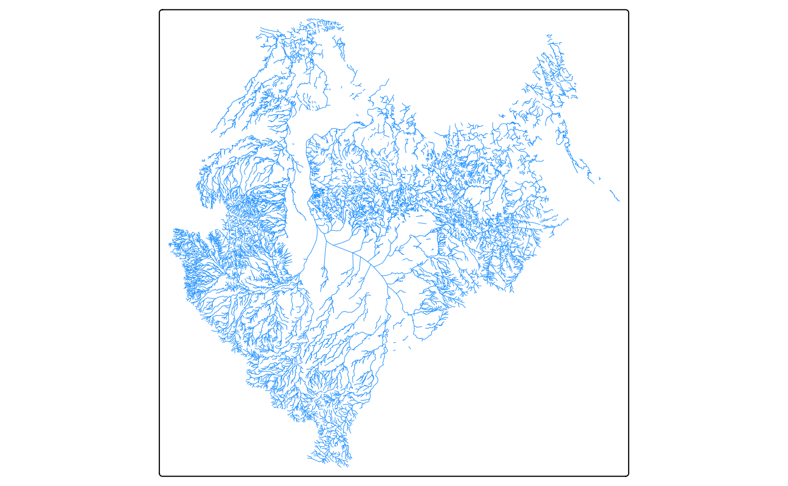
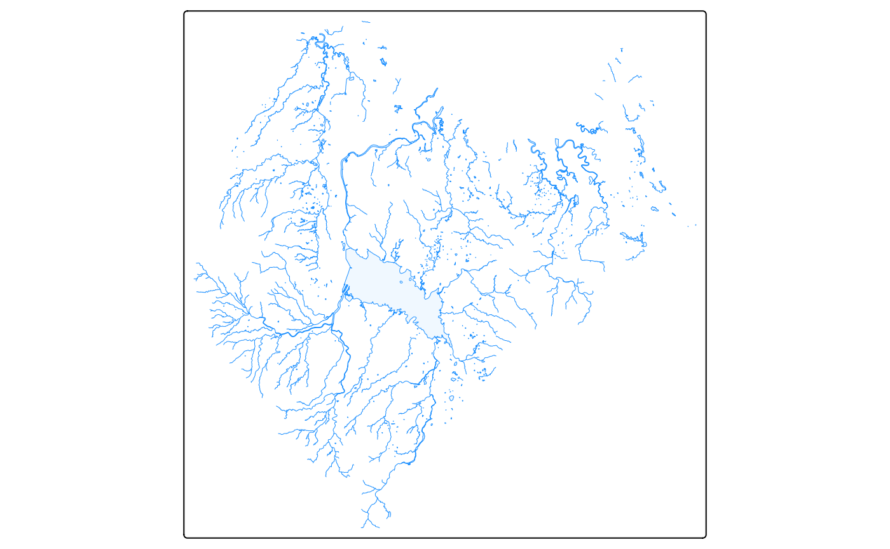
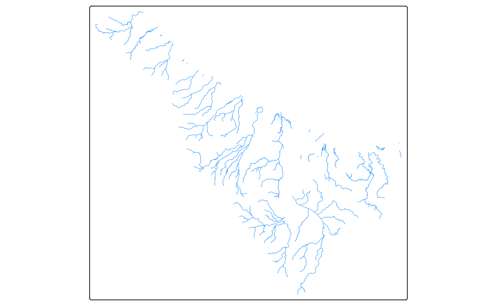
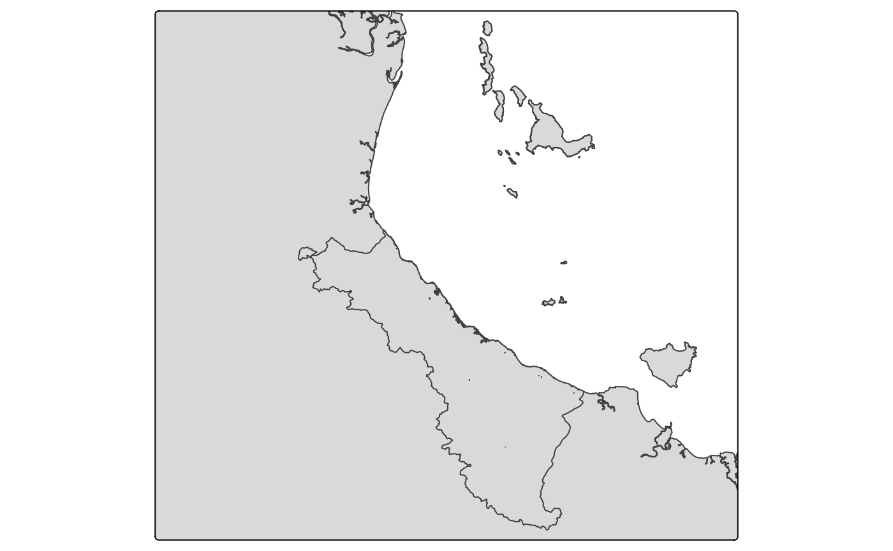

# Creating Maps

## Introduction

Maps are a commonly required feature across all Regional Report Cards.
Equally, analysis often happens in R across each of the Regional Report
Cards. It stands to reason that creating maps in R is both a logical and
efficent thing to do. However, maps made in R face a few reoccuring
issues:

- Styling: creating a nicely styled map in R is time consuming and not
  easy
- Repetition: maps are often created across several analysis workflows
  and thus code is repeated (yuck)
- Difficulty: creating maps in R is nowhere near as easy as GIS programs
  with a GUI
- Choice: there are a range of packages use to create maps

To help address some of these issues, two mapping functions have been
made:

1.  maps_water_layer()
2.  maps_inset_layer()

These functions have been designed to be as generic as possible, whilst
also removing as much repeatable code as possible. The goal is to allow
the user to focus on adding the specific dataset for the map, and
styling the map how they want. The functions use the Tmap package. This
package is one of the most popular and easily understood mapping
packages, it handles a wide range of data (such as eReefs) and provides
interactive options easily.

## Maps Water Layer

The maps_water_layer() function does exactly as it says, and creates a
water layer for your map. Specifically, it creates a rivers, creeks, and
lakes layer for your map. The output from this function can be added to
any map to instantly improve the “base” of the map. In its most simple
form, the function only requires you to provide a basin name that exists
within Queensland:

``` r

library(RcTools)
library(tmap)
```

``` r

#create the water layer
my_water_layer <- maps_water_layer("Ross")
#> Registered S3 method overwritten by 'jsonify':
#>   method     from    
#>   print.json jsonlite
#> [working] (0 + 0) -> 5 -> 2 | ■■■■■■■■■■                        29%
#> [working] (0 + 0) -> 0 -> 7 | ■■■■■■■■■■■■■■■■■■■■■■■■■■■■■■■  100%

#visualise
my_water_layer
```



If you spell a basin wrong, or provide an incorrect basin, the function
will warn you and give a list to choose from:

``` r
#create the water layer
my_water_layer <- maps_water_layer("Fake")
#> Error in `extract_watercourses()`:
#> ! The following basin argument(s) are invalid: 'Fake'. Try one of: Brisbane, Burdekin, Balonne-Condamine, Coleman, Barron, Mary, Burnett, Holroyd, Noosa, Don, Border Rivers, Pine, Ross, Murray, Archer, Paroo, Logan-Albert, Wenlock, Mitchell, Cooper Creek, Normanby, Haughton, South Coast, Diamantina, Fitzroy, Tully, Herbert, Mulgrave-Russell, Burrum, Bulloo, Whitsunday Island, Proserpine, Georgina, Endeavour, Embley, Lockhart, Black, Maroochy, Kolan, Boyne, Waterpark, Calliope, Gilbert, Baffle, Staaten, Johnstone, Moonie, Settlement, Mornington Island, Fraser Island, Curtis Island, Flinders, Jeannie, Olive-Pascoe, Ducie, Daintree, Mossman, Arafura Sea, Jardine, Nicholson, Warrego, Morning, Leichhardt, Norman, Watson, O'Connell, Jacky Jacky, Pioneer, Coral Sea, Stewart, Moreton Bay Islands, Plane, Hinchinbrook Island, Shoalwater, Styx, Torres Strait Islands
```

The function does get more complex, here is an example that provides all
arguments:

``` r

my_water_layer <- maps_water_layer("Ross", WaterLines = TRUE, WaterAreas = TRUE, WaterLakes = TRUE, StreamOrder = 2)
#> [working] (0 + 0) -> 1 -> 1 | ■■■■■■■■■■■■■■■■                  50%
#> [working] (0 + 0) -> 0 -> 2 | ■■■■■■■■■■■■■■■■■■■■■■■■■■■■■■■  100%

my_water_layer
```



In the case of the second map we have:

- asked for water lines (i.e. rivers, and creeks) - this defaults to
  TRUE
- asked for water areas (i.e. unnamed waterbodies such as wetlands) -
  this defaults to FALSE
- asked for water lakes (i.e. Ross Dam) - this defaults to FALSE
- specified the strahler stream order for water lines (we want
  streamorder 2 or bigger)

Finally, a third variation would be:

``` r

my_water_layer <- maps_water_layer(c("Ross", "Black"), WaterLines = TRUE, StreamOrder = c(3,5))
#> [working] (0 + 0) -> 1 -> 1 | ■■■■■■■■■■■■■■■■                  50%
#> [working] (0 + 0) -> 0 -> 2 | ■■■■■■■■■■■■■■■■■■■■■■■■■■■■■■■  100%

my_water_layer
```



Note that in this case we have provided multiple basins and also
specified both a min and max strahler stream order.

In all cases, the output of the function can then be passed into your
wider tmap mapping call.

## Maps Inset Layer

The maps_inset_layer() is exclusively for maps that you want to save to
file. This function helps to smooth over the annoyingly tricky process
of creating a inset map in the upper right corner of your main map.
Inset maps are often needed to provided additional spatial context for
where your main map is - particularly if your main map is quite zoomed
in.

The function requires a few mandatory inputs, and has some optional
extras. Mandoratory inputs are:

- An sf object that defines the focus of the main map
- A background sf object
- An aspect ratio

Where, the sf object that defines the focus of the main map would be,
for example, a series of water quality sampling sites in the Ross Basin.
While the background sf object could be an outline of the Ross Basin
itself, or an outline of the entire Dry Tropics region, etc.

Using this function requires a bit more work than the first function:

First you need to run the function with the required arguments:

``` r

#create an example background object
black_basin <- system.file("extdata/black.gpkg", package = "RcTools")
black_basin <- sf::st_read(black_basin)
#> Reading layer `black' from data source 
#>   `/home/runner/work/_temp/Library/RcTools/extdata/black.gpkg' 
#>   using driver `GPKG'
#> Simple feature collection with 1 feature and 0 fields
#> Geometry type: MULTIPOLYGON
#> Dimension:     XY
#> Bounding box:  xmin: 146.1444 ymin: -19.43266 xmax: 146.6946 ymax: -18.53782
#> Geodetic CRS:  GDA2020

#create example wq sites
wq_sites <- data.frame(
  Site = c(1,2,3),
  Lat = c(-18.89483, -18.81886, -18.79427),
  Long = c(146.2215, 146.6117, 146.6336)) |> 
  sf::st_as_sf(coords = c("Long", "Lat"), crs = sf::st_crs(black_basin))

#run the function
my_inset_objects <- maps_inset_layer(wq_sites, black_basin, 1.1)
```

The function returns a list of length 2. The two items in the list are:

1.  Inset Map
2.  Inset Viewport Positioning

To use thse two items, you then need to create a map that the inset map
will sit within, which looks as follows:

``` r

my_main_map <- tm_shape(qld) +
  tm_polygons() +
  tm_shape(black_basin, is.main = TRUE) + 
  tm_polygons() +
  tm_layout(asp = 1.1) #note to make the aspect of the main map the same as your inset map

my_main_map
```



Then, when you go to save this main map, you can input the two items
from the inset mapping function into the tmap saving function

``` r
#save the map
tmap_save(my_main_map, insets_tm = my_inset_objects[[1]], insets_vp = my_inset_objects[[2]])
```

If you wish to extent the function, the following options/alternatives
are provided:

- you can either use a bounding box to define your area of interest, or
  use the original spatial object
- you can change the outline colour of the area of interest
- you can supply a second area of interest, and also customise it the
  same way (box/outline, and colour)
- you can change the colour of the background object
