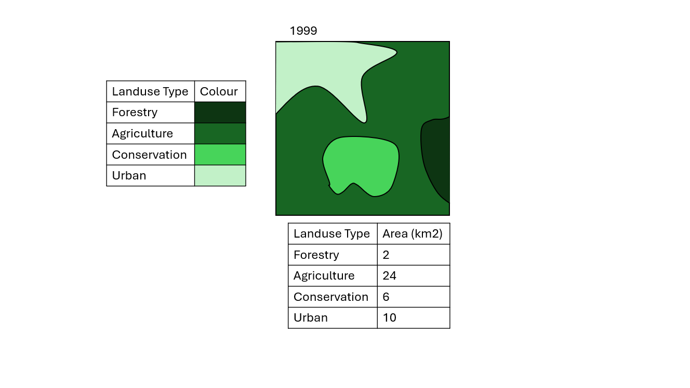
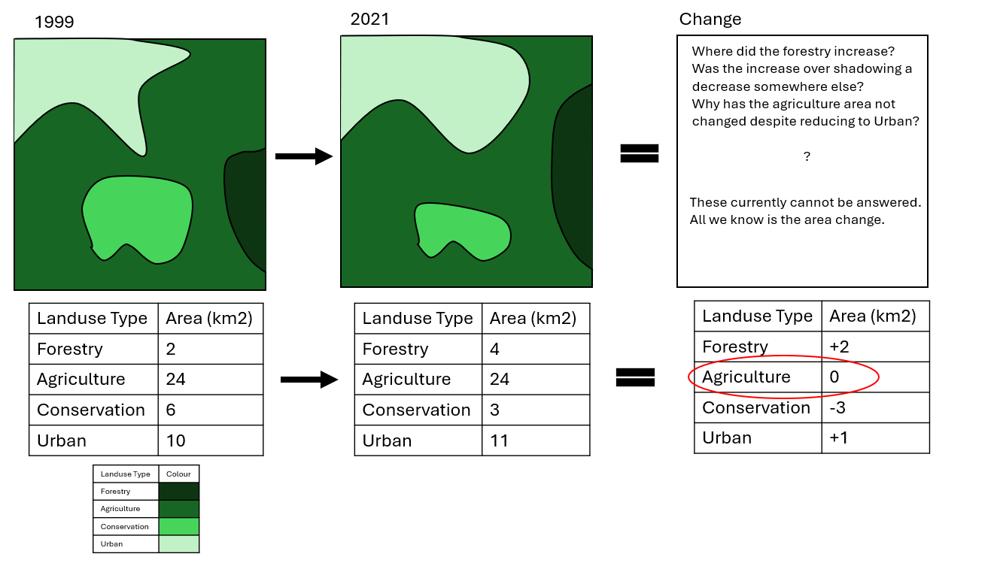
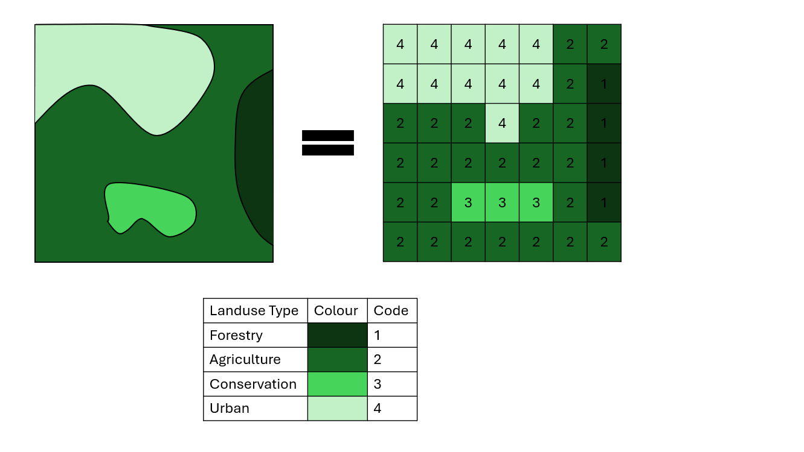
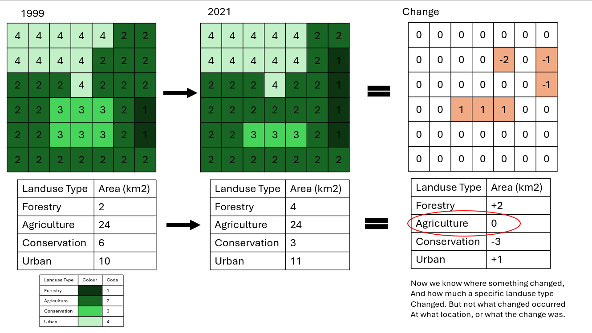
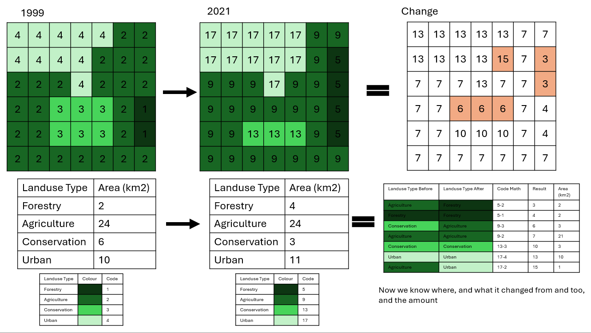

```{r, include = FALSE}
knitr::opts_chunk$set(
  collapse = TRUE,
  comment = "#>"
)
```

# Introduction

Within this package there are a few functions that don't neatly fit into one particular theme, these have been gather here under "miscellaneous helpers". Currently the functions discussed here are:

 - get_quarto_params()
 - name_cleaning()
 - sf_change_over_time()

Each functions requirements and use will be touched on below.

## Get Quarto Params

This is a simple utility function for anyone writing code using Quarto (new version of Rmarkdown) that also uses [params](https://quarto.org/docs/computations/parameters.html). 

The motivation for this function comes from the dual interactive/static runtime that Quarto has. Specifically, when the script is run interactively (i.e. in RStudio while you are writing code), quarto params are easily accessible. However, when the script is run for a render (i.e. to create a HTML doc), quarto params are not accessible in the same way. No arguments are needed for this function:

```{r}

library(RcTools)

```

```{r setup}
#| eval: FALSE

#params <- get_quarto_params()

```


## Name Cleaning

This function extends on the [janitor](https://cran.r-project.org/web/packages/janitor/vignettes/janitor.html) package, and provided a standardised format for the Northern Three teams to clean their dataframe column names with. Specifically the rules are:

 - Use upper camel case (LikeThisTextHere)
 - Remove any spaces, dashes, or underscores
 - Replace any geometry/shape/geom column with "geom" (spatial datasets only)
 - Remove strangely encoded characters that don't adhere to ASCII formatting

The function takes a tabular input, and returns a table:

```{r}

df <- data.frame(
  "Column 1" = c(1,2,3),
  "column-2" = c(1,2,3),
  "COLUMN    3" = c(1,2,3)
)

df <- name_cleaning(df)

```

## SF Change Over Time

This is an experimental function designed to take a spatial vector object that measures something over time, and return a gridded change log. An example of the type of data that this would be useful for would be landuse data. The logic behind this function is best explained with imagery:











For this function to run the dataset needs to meet a few requirements:

 1. The data must be vector data - specifically, polygons
 2. The data must have a single column that defines year
 3. The data must have a specific identity assigned to each polygon

In practice, this function can be used as follows:

```{r}

#create a list containing a bunch of basic polygons (squares)
polygons <- list(
  rbind(c(0,0), c(1,0), c(1,1), c(0,1), c(0,0)), 
  rbind(c(1,0), c(2,0), c(2,1), c(1,1), c(1,0)),
  rbind(c(0,1), c(1,1), c(1,2), c(0,2), c(0,1)),
  rbind(c(1,1), c(2,1), c(2,2), c(1,2), c(1,1)))
 
#convert the list into a true sf object
polygons <- sf::st_sfc(lapply(polygons, function(x) sf::st_polygon(list(x))))
 
#provide additional context to the sf object
poly_sf <- dplyr::bind_rows(
  sf::st_sf(Year = 2000, Id = c("a", "b", "c", "d"), geometry = polygons, crs = 4326), 
  sf::st_sf(Year = 2020, Id = rep("a",4), geometry = polygons, crs = 4326))

#run the change over time function
change <- sf_change_over_time(poly_sf, "Id", 2000, 2020)

#map the result to visualise the tracking of cell changes.
tmap::tm_shape(change) + tmap::tm_polygons(fill = "ValueChange")

```

